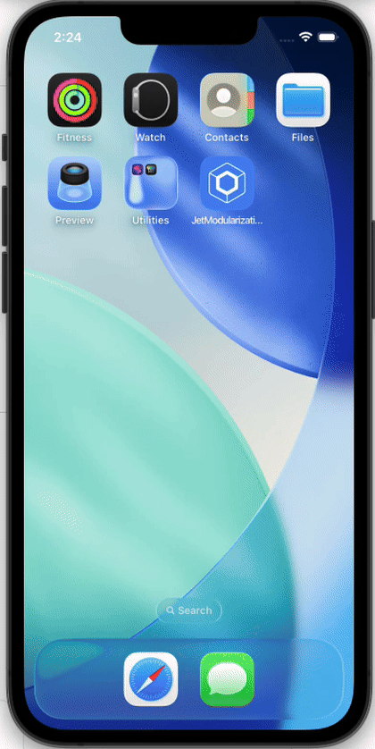

# JetModularizationKMP

## 🚀 Overview

JetModularizationKMP is a **small Kotlin Multiplatform project** showcasing a **clean architecture** approach with **shared business logic and UI** across **Android and iOS** apps.  
It uses Kotlin Multiplatform (KMP) with a Compose‑based UI in a modularized structure.

---

## 📱 App Demo

| Android | iOS |
|---------|-----|
|  |  |

---

## 🧠 What This Project Shows

This repo demonstrates:

✔ Kotlin Multiplatform Project (KMP) setup  
✔ Modularization by layers (shared + platform code)  
✔ Compose Multiplatform UI for Android and iOS  
✔ Clear separation of common, Android‑only, and iOS‑only modules

The project structure includes:

📦 JetModularizationKMP
┣ 📂 composeApp ← Shared multiplatform UI + logic
┣ 📂 iosApp ← iOS specific entry point
┣ 📂 gradle ← Gradle configuration
┣ 📜 build.gradle.kts
┣ 📜 settings.gradle.kts
┗ 📜 .gitignore


---

## 🛠 Tech Stack

This project uses:

| Layer | Technology |
|-------|------------|
| Shared logic | **Kotlin Multiplatform (KMP)** |
| UI | **Compose Multiplatform** |
| Android entry | Android + Compose |
| iOS entry | Swift + Compose UI Integration |
| Build system | **Gradle (Kotlin DSL)** |
| Tooling | Android Studio / Xcode |
| Platforms | Android & iOS |

> This structure lets you write UI logic once in `composeApp`, and share as much code as possible across platforms. :contentReference[oaicite:0]{index=0}

---

## 📦 Libraries & Plugins

This project primarily uses official Kotlin and Compose tools:

- **kotlin("multiplatform")** — Kotlin Multiplatform plugin  
- **Compose Multiplatform** — Shared UI framework  
- **Android Gradle Plugin** — For building Android  
- **Xcode + CocoaPods** (when integrating shared framework into the iOS app)

For dependency management you likely use version catalogs (`libs.versions.toml`) to organize libraries across modules.

---

## 🚀 Build & Run

### Android

Use Android Studio or terminal:

```bash
./gradlew :composeApp:assembleDebug
```

Then install the APK on an emulator or device.

### iOS

1. Open the iosApp folder in Xcode
2. Make sure you’ve built the shared Kotlin framework
3. Run the app on an iOS simulator or device

---

## 📁 Project Structure

### composeApp

Contains the shared code:
```bash
commonMain/         → Shared business logic + shared Compose UI
androidMain/        → Android‑specific code
iosMain/            → iOS‑specific code
```
### iosApp

Houses the iOS app entry point and UI integrations.

---

## 📘 Learnings & Features

This project helps you understand how to:

✔ Set up Kotlin Multiplatform with Compose UI  
✔ Structure shared modules vs platform modules  
✔ Build for Android and iOS from the same codebase  
✔ Modularize clean architecture layers  
